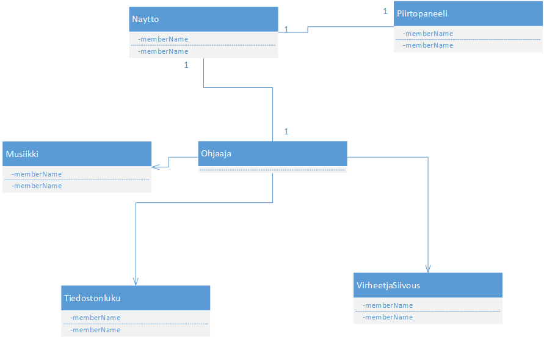
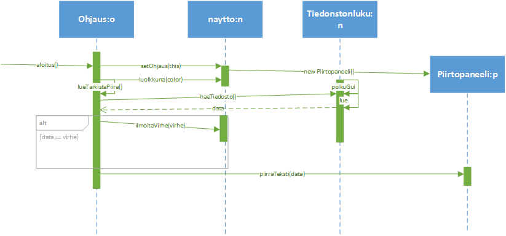
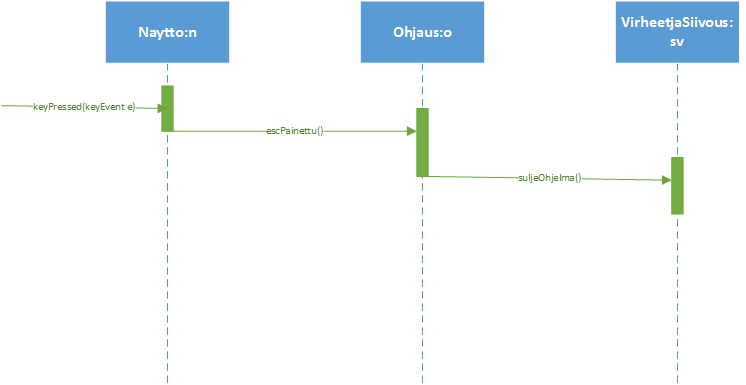

## Aihemäärittely

**Aihe:** Ohjelma, joka tulostaa näytölle coolisti käyttäjän koodia hänen
määrittelemästä lähteestä...ehkä myös mahdollisuus vaikuttaa ohjelman graafisen esityksen
kulkuun lennosta? Tarkoitus olisi myös luoda käyttöliittymä ohjelman configurointiin.

**Käyttäjät:** Ohjelmoinnista innostuneet.

**Käyttäjien toiminnot:**

	*Ohjelman konfigurointi käyttöliittymästä-
	*Koodin ulkoasun customointi-
	*Mahdollisuus vaikuttaa ohjelman kulkuun?
	*Jotain muuta kivaa?
	
	
**Tässä 5 vaiheen UML kaavio**

**Sekvenssikaavio datan hakemisesta ja esittämisestä:**

**Sekvenssikaavio virheenIlmoitus käyttötapauksesta:**

	

