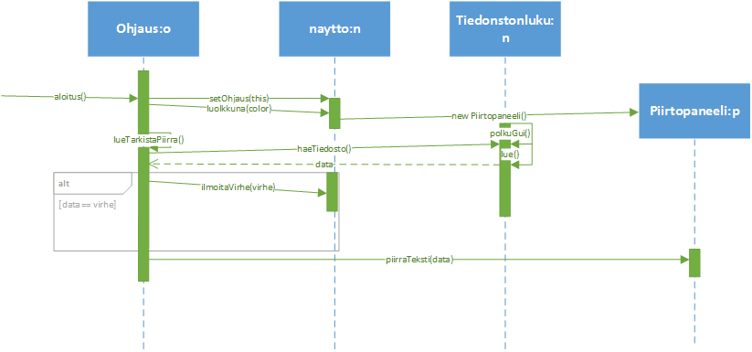

## Aihemäärittely

**Aihe:** Ohjelma, joka tulostaa näytölle coolisti käyttäjän koodia hänen
määrittelemästä lähteestä...myös mahdollisuus vaikuttaa ohjelman graafisen esityksen
kulkuun lennosta ja pelata/piirrellä.

**Käyttäjät:** Ohjelmoinnista ja hassuista kuvioista innostuneet.

**Käyttäjien toiminnot:**

	* Pelata snake ja räjähdys pelia.
	* Piirtää ohjelmalla.
	* Vaihdella piirto teemoja.
	* Muokata näytettävän datan suuruutta ja muotoa(määrittellä siis mitä dataa käyttää).
	
	
**UML kaavio:**

**Rakennekuvaus:**
Ohjelmassa on 2 luokkaa kayttoliittymässä, 3 logiikassa ja 1 ohjauksessa. Logiikassa luodaan välineet tiedostojen hakuun TiedostonLuku luokassa, käsitellään virheet ja lopetus VirheetJaSiivous luokassa ja hallinnoidaan palloa Pallo puokassa. Ohjaaja välittää käskyjä
käyttöliittymälle, logiikalle ja niiden välillä. Käyttöliittymä paketissa saatu data manipuloidaan sopivaksi Piirtopaneelissa ja näytetään graafisesti erilaisten piirto metodien avulla. Naytto luokka luo näytön ja kuuntelee tapahtuma välittäen tiedot niistä 
ohjaajalle, joka taas välittää ne eteenpäin oikeille tahoille. Aja luokka luo tarvittavat luokat ja käynnistää ohjelman Ohjauksen kautta.

**Sekvenssikaavio datan hakemisesta ja esittämisestä:**

**Sekvenssikaavio käyttötapauksesta; virheen ilmoitus:**

	

